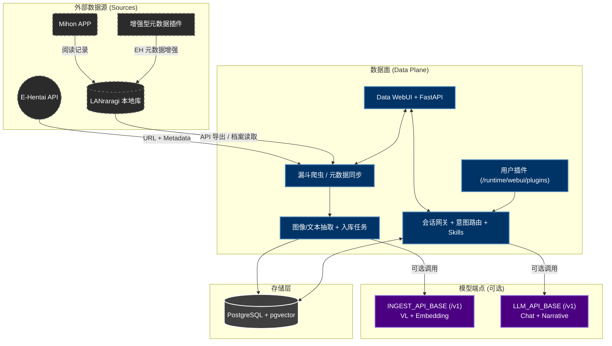

# AutoEhHunter

> 🌐 语言 / Language: [中文](README.md) | [English](README_EN.md)

### 面向 E-Hentai 与 LANraragi 的私有化多模态 RAG 检索系统

  

  
   
  <em>AutoEhHunter</em>

## 开发初衷 (Motivation)

**“为什么我记得封面长什么样，记得剧情，却因为想不起那个 Tag / 标题 而找不到那本书？”**

AutoEhHunter 的目标是把“死板关键词搜索”升级成“可理解语义和视觉线索”的检索体验，让用户可以按感觉找作品，而不必像数据库一样思考。

## 项目概览 (Overview)

AutoEhHunter 以 **Data 容器** 为主入口，提供：

- EH/LRR 数据同步与清洗
- SigLIP 视觉向量入库
- 文本/图像/图文混合检索
- 聊天路由、技能调用与插件扩展

> **"停止盲搜，开始对齐。"**

## 系统架构 (Architecture)

## 核心特性 (Core Features)

### 1. 多模态语义检索
* 视觉搜索：上传图片按视觉向量检索
* 文本搜索：支持模糊标签映射与自然语言查询
* 图文混合：独立通道加权融合

### 2. 数据闭环与清洗
* EH 漏斗爬虫 + LRR 元数据导出
* 可选标签翻译与元数据增强
* 入库任务可定时化

### 3. 推荐与画像
* XP 聚类与近期偏好估计
* 推荐参数可调（严格度、Tag/视觉权重）

### 4. 聊天与技能系统
* 自动/手动意图：chat/profile/search/report/recommendation
* 内置技能 + 用户插件动态加载

## 容器规格与资源需求 (Requirements)

### `data-ui` 容器（主入口）
* 定位：WebUI + FastAPI + 调度 + 聊天网关
* 默认可在 CPU-only 环境运行

### 外部模型端点（可选）
* 支持 OpenAI-compatible `/v1`
* 可单端点代劳 VL/Embedding/LLM
* 也可分离：`INGEST_API_BASE` 与 `LLM_API_BASE`

## 快速开始 (Getting Started)

* **[快速启动指南 (STARTUP.md)](STARTUP.md)**
* **[Quick Start (STARTUP_EN.md)](STARTUP_EN.md)**
* **[贡献指南 (CONTRIBUTING.md)](CONTRIBUTING.md)**

## 配置与持久化说明

- 配置优先级：`app_config(DB) > JSON fallback > .env`
- 可先启动容器，再在 Settings 页面完成配置
- 未配置 LLM 时，基础功能仍可用；自然语言增强能力会受限

## 技术栈 (Technology Stack)

* PostgreSQL 17 + pgvector
* FastAPI + Vue 3
* SigLIP (CPU-only 默认)
* OpenAI-compatible `/v1` model endpoints

## 免责声明 (Disclaimer)

本工具仅供信息检索研究与个人归档使用。请遵守目标站点 ToS 与当地法律法规。
