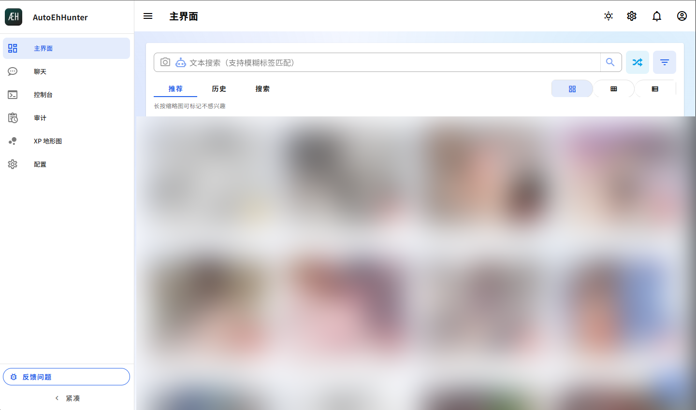
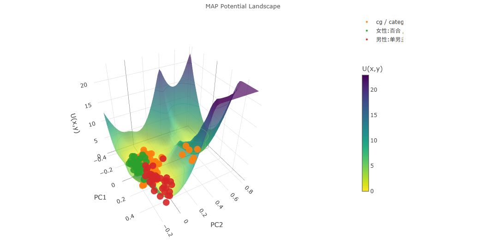
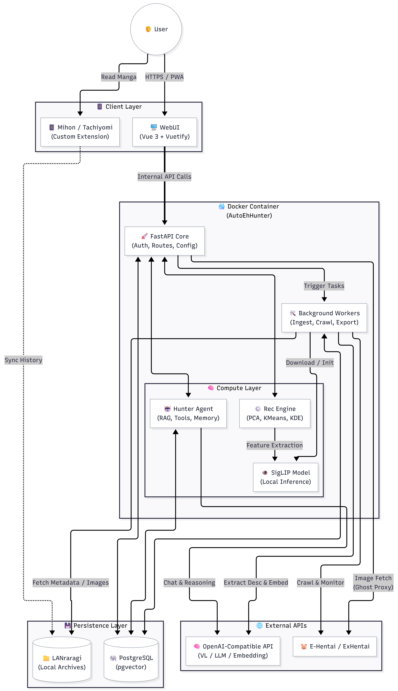

  
   

# AutoEhHunter
   

> 🌐 语言 / Language: [中文](README.md) | [English](README_EN.md)

### 面向 E-Hentai 与 LANraragi 的私有化多模态 RAG 与分析系统

  
   

## 摘要 (Abstract)
AutoEhHunter 是一个运行于本地的检索增强生成（RAG）与用户偏好分析系统。它以 E-Hentai（外部数据源）和 LANraragi（本地图库）为基础，通过引入计算机视觉（SigLIP）、大语言模型（LLM）以及严谨的数学统计算法，构建了一个全链路的数字资产治理与推荐闭环。本项目的核心目标是消除传统基于布尔逻辑的标签检索系统带来的高认知负荷，将图库管理转化为基于高维向量和自然语言交互的直觉化过程。

## 动机 (Motivation)
人类对视觉和叙事内容的记忆是模糊且感性的，但现有的图库系统却要求用户像 SQL 解析器一样思考。当你想寻找“某本色调偏暗、画风类似某作者的纯爱本”时，传统的 Tag 搜索往往无能为力。

开发这个项目并非为了向大众推销某种“终极神器”，纯粹是出于一名工程强迫症患者的自我救赎：我无法忍受残缺的元数据、丢失的封面，更无法忍受面对成千上万的本子却不知道看什么的“赛博ED”。既然要做，那就用最严谨的技术栈，把“看本子”这件事当成一个严肃的工程和统计学课题来解决。

---

## 核心技术特性 (Core Features)

### 1. 基于能量重排序的多模态融合推荐
抛弃了简单的线性打分机制，系统采用一套受物理能量模型启发的推荐算法。
* **原理**：将用户的阅读历史（喜欢/不喜欢/阅读时长）视为向量空间中的“引力源”或“斥力源”。算法在运行时动态融合视觉向量（SigLIP）、语义向量（BGE-M3等）和元数据，并引入了基于交互的隐式衰减惩罚（Interaction Decay Factors，例如曝光惩罚和误触惩罚）。系统计算候选作品在当前用户特征场中的“势能”，并根据玻尔兹曼分布（Boltzmann distribution）引入热力学扰动（Thermal Jitter）进行采样。势能越低（越契合）的作品被抽中的概率越大，从而实现高度动态的个性化推荐与探索发现平衡。

### 2. 学术级的 XP 聚类分析 (XP Clustering Analysis)

  
   

拒绝无意义的词云统计，使用数据科学的方法严谨地解构你的偏好。
* **高斯核密度估计 (Gaussian KDE)**：对 1024 维的特征向量进行主成分分析（PCA），降维至 2D/3D 空间。通过 KDE 算法生成平滑的概率密度拓扑图，直观可视化你的“好球区”分布。
* **层次聚类 (Hierarchical Clustering)**：基于 SciPy 生成树状图（Dendrogram），自动发掘你可能甚至都没意识到的潜在 XP 子类，并支持动态切割阈值。

### 3. 多模态图文混合检索 (Hybrid Search)
打破语言和标签的物理隔离。
* **视觉与 VL 融合**：支持原生 SigLIP 图像特征提取（以图搜图），并结合 Vision-Language 大模型对画廊进行深度图文理解。
* **NLP 与模糊匹配**：你可以直接输入自然语言，系统内置的 Agent 路由会将自然语言映射为高维向量，并结合 LLM 驱动的模糊标签匹配（Fuzzy Matching），在本地数据库中进行毫秒级的混合权重检索。

### 4. 企业级安全性 (Enterprise-grade Security)
对于包含极度私密信息的系统，安全性不应只是选修课。
* **密码学标准**：敏感信息（如 E-Hentai Cookie、API 密钥）落库前均经过严格的加密处理（动态 Salt、灵活的哈希迭代次数、独立 Pepper、HKDF 密钥派生）。
* **配置收敛**：全局配置由 PostgreSQL 统一管理（支持紧急回退至 JSON/Env）。
* **最小化攻击面**：彻底摒弃了暴露在外的无鉴权 HTTP API 端口。所有高计算量任务（如 SigLIP 推理、爬虫拉取）全部收束于后端 Worker 进程内部，由 WebUI 通过安全的内部路由触发。
* **Sudo 提权机制**：WebUI 敏感操作（如修改数据库连接、清除缓存）强制要求 Sudo 二次密码验证。

### 5. 运维友好设计 (Ops-Friendly)
考虑到 Self-hosted 环境的复杂性，系统设计了极高的容错率。
* **全局异常捕获**：底层的 Traceback 堆栈信息会被优雅地捕获，并发送至前端的通知中心，彻底告别“需要 SSH 进容器看日志才知道哪坏了”的窘境。
* **无状态急救码**：初始化时生成“用后即焚”的 Recovery Codes。即使忘记管理密码或遭遇数据库连接故障，也能通过急救码无缝进入应急恢复模式。

### 6. Agent 功能与分级上下文
系统不仅仅是一个搜索引擎，更是一个“懂你”的战术副官。
* **情境感知**：内建基础 Agent 路由，AI 会根据你的提问自动调用本地向量数据库获取上下文（RAG），支持针对你的图库和统计画像进行自由对话。
* **可扩展接口**：底层预留了标准的 Tool Call 插件接口，为未来接入更复杂的自动化工作流打下了基础。

### 7. 移动端优化与全平台支持

  
   

* 前端基于 Vue 3 + Vuetify 构建，采用响应式布局，针对移动端触屏进行了大量滑动、防误触及手势优化。
* 支持 **PWA (Progressive Web App)**，可直接添加到手机桌面，获得媲美原生 App 的沉浸式无边框体验。

### 8. 全链路数据治理 (Data Governance)
好模型建立在好数据之上。本项目提供了一整套数据清洗与收集套件：
* **增强型 LANraragi EH 插件**：基于正则表达式深度定制，完美兼容并修复非标准的 `.xml` 或早期 Ehviewer 遗留的残缺元数据。
* **定制版 Mihon (Tachiyomi) 插件**：在移动端阅读时，自动将阅读历史通过 LANraragi API 回传，确保你的每一次翻页都能转化为滋养推荐算法的真实养料。

---

## 系统架构 (System Architecture)

  
   

---

## 配置要求与快速启动 (Requirements & Quick Start)

本系统采用容器化部署，支持零配置冷启动（Zero-Config Cold Start）。

* **最低要求**：4 核 CPU / 4GB RAM / 任意支持 Docker 的系统 (NAS / Linux / Windows)。
* **外部依赖**：需要一个正常运行的 PostgreSQL 17+ 数据库（**必须开启 `pgvector` 插件**）。
* **可选依赖**：LANraragi本地图库，用于提供基于本地阅读记录的用户画像。如果不安装，推荐功能依旧可用，但数据分析，Agent等依赖数据链路闭环的服务将不可用。

### 模型配置建议 (Model Configuration)
本系统针对大语言模型和 Embedding 提供了高自由度的路由配置（均可在 WebUI 动态修改）：
* **推荐配置**：8 核 CPU / 16GB RAM / 一台能运行兼容 OpenAI (`/v1`) 接口的后端（例如 LM Studio, vLLM, Ollama 等）。需要其支持至少 8B 参数的 Vision-Language (VL) 模型用于生成图库画廊的精准文本描述，以及常规 LLM 用于 Agent 聊天与分析。
* **单端点模式**：配置一个强大的 `/v1` 端点（如大型 vLLM 实例），同时承担 图像描述生成(VL) + 语义向量(Embedding) + 对话交互(LLM)。
* **双/多端点模式**：
  * `INGEST_API_BASE` (入库通道)：专用于画廊的元数据与图像清洗（VL/Embedding），可配置专用的轻量化模型。
  * `LLM_API_BASE` (交互通道)：用于 Agent 聊天、XP 解析报告、搜索意图路由（可对接其他本地高智商开源模型）。
* **最小实践建议**：一个 `/v1` 端点（Ollama，LM Studio 等）装载一个 4B 级别的 VL 模型以及 BGE-M3 模型。模型规模本身没有限制，但太小的模型可能会生成不准确的视觉描述和低质量的 Agent 文本，请自行斟酌。
* **隐私与审查限制**：基于本项目数据的敏感性，极不建议使用云端 API；且带审查的模型（非 abliterated 模型）可能会频繁触发安全限制，影响入库文本描述精度和 Agent 性格。

**快速启动：**
1. 克隆本仓库 `git clone https://github.com/JBKing514/AutoEhHunter`
2. 进入项目目录 `cd AutoEhHunter`
3. 执行 `docker-compose -f Docker/quick_deploy_docker-compose.yml up -d` 来拉起AutoEhHunter，PostgreSQL（pgvector17）和LANraragi容器。
4. 访问 `http://<你的IP>:8501`，跟随屏幕上丝滑的 **Setup Wizard（初始向导）** 填写数据库和 API 信息即可，无需手动修改任何 `.env` 文件。

> 详细的部署说明、代理配置与进阶网络（Macvlan/Gluetun）设置，请参阅 [**STARTUP.md**](STARTUP.md)。

---

## 开发环境与贡献 (Development & Contribution)

本项目的代码生成部分深度融合了 AI 辅助编程（"Vibe Coding"）。但请放心，系统的整体架构设计、数学模型推导、安全性论证以及每一次的 Git Commit，均由具备严格工程标准的真人类（一名研究电磁场与天线的在读博士）进行 Review 与提交把控。

由于系统的极客属性与特定领域的约束，我们目前不主动寻求大规模的社区扩散。如果你也恰好有同样的强迫症并认可这套架构哲学，欢迎提交 Issue 或 PR。

* 前端栈: Vue 3 (Composition API), Pinia, Vuetify, Vite
* 后端栈: FastAPI, Psycopg 3, HTTPX, PyTorch, Transformers
* 算法栈: SciPy, Scikit-learn

## ⚠️ 免责声明 (Disclaimer)

本工具仅供 **信息检索技术研究与个人图库归档** 使用。用户需对使用本软件访问、下载或存储的所有内容承担全部责任。请务必遵守您所访问的任何外部网站的服务条款 (ToS)，合理配置抓取频率。