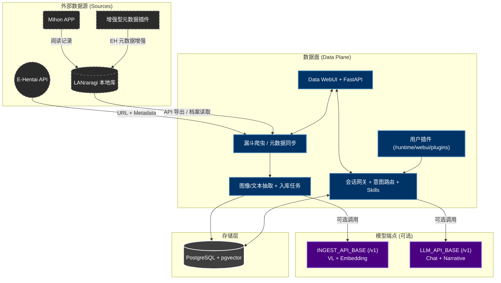

# AutoEhHunter

> 🌐 语言 / Language: [中文](README.md) | [English](README_EN.md)

面向 E-Hentai 与 LANraragi 的私有化多模态检索工作台（Data-Only 主架构）。

## 项目状态

- 主链路已简化到 `data` 容器（WebUI + API + 调度 + 聊天路由）。
- 不再依赖 `compute` / `n8n` 才能运行核心功能。
- 可直接先拉起容器，再在 WebUI 的 `Settings` 完成配置。
- 支持单端点 `/v1` 同时承担 VL + Embedding + LLM；也支持入库端点与聊天端点分离。

## 架构图（中文）



## 部署方式

### 1) 快速模板（一键）

使用 `Docker/quick_deploy_docker-compose.yml`：

```bash
docker compose -f Docker/quick_deploy_docker-compose.yml up -d
```

该模板会拉起：`pg17 + lanraragi + data-ui`。

### 2) 手动模板（按需分步）

- PostgreSQL：`Docker/pg17_docker-compose.yml`
- LANraragi：`Docker/lanraragi_docker-compose.yml`
- Data 主服务：`Docker/main_docker-compose.yml`

你可以按机器条件分别启动（例如模型端点放在其他主机），然后在 `Settings` 里填对应地址和模型。

## 模型连接策略

- 可选单端点：一个 `/v1` 同时用于入库和聊天。
- 可选双端点：
  - `INGEST_API_BASE`：偏向成本/速度（VL+Embedding）
  - `LLM_API_BASE`：偏向对话质量（Chat/NLG）
- 不配置 LLM 时：基础检索和数据链路仍可用；自然语言检索/报告叙事等增强功能不可用。

## 文档入口

- [快速启动（中文）](STARTUP.md)
- [Quick Start (English)](STARTUP_EN.md)
- [贡献指南（中文）](CONTRIBUTING.md)
- [Contribution Guide (English)](CONTRIBUTING_EN.md)
