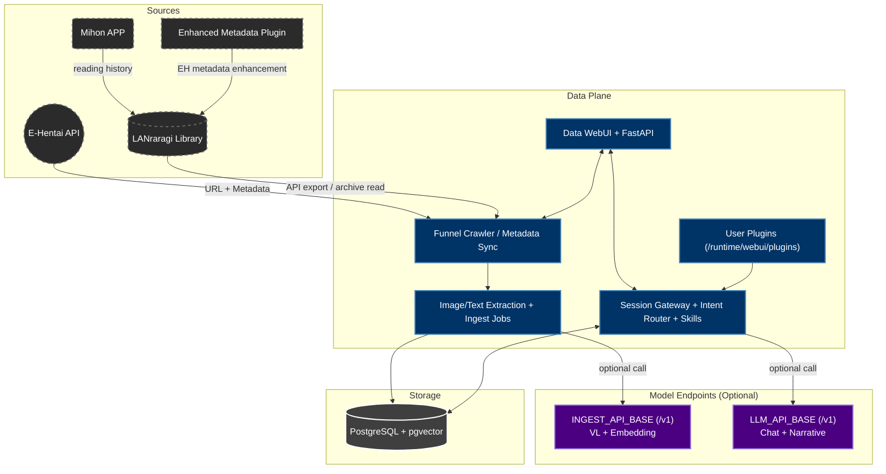

# AutoEhHunter

> 🌐 Language / 语言: [English](README_EN.md) | [中文](README.md)

Private multimodal retrieval workspace for E-Hentai + LANraragi (Data-Only primary architecture).

## Current State

- Core path is consolidated into the `data` container (WebUI + API + scheduler + chat routing).
- `compute` / `n8n` are no longer required for baseline operation.
- You can start containers first, then configure everything from WebUI Settings.
- Supports either:
  - single `/v1` endpoint for VL + Embedding + LLM
  - split ingest/chat endpoints

## Architecture (English)



## Deployment Modes

### 1) Quick Template (one command)

Use `Docker/quick_deploy_docker-compose.yml`:

```bash
docker compose -f Docker/quick_deploy_docker-compose.yml up -d
```

This template launches: `pg17 + lanraragi + data-ui`.

### 2) Manual Templates (step-by-step)

- PostgreSQL: `Docker/pg17_docker-compose.yml`
- LANraragi: `Docker/lanraragi_docker-compose.yml`
- Data service: `Docker/main_docker-compose.yml`

You can start them separately (e.g. run model endpoints on another machine), then point addresses/models in Settings.

## Model Connectivity Strategy

- Single endpoint mode: one `/v1` for ingest + chat.
- Split endpoint mode:
  - `INGEST_API_BASE`: cheaper/faster model stack for VL+embedding
  - `LLM_API_BASE`: larger model stack for chat/NLG
- Without LLM config: baseline retrieval and ingest still work; NL search/report narratives are disabled.

## Docs

- [Quick Start](STARTUP_EN.md)
- [快速启动（中文）](STARTUP.md)
- [Contribution Guide](CONTRIBUTING_EN.md)
- [贡献指南（中文）](CONTRIBUTING.md)
