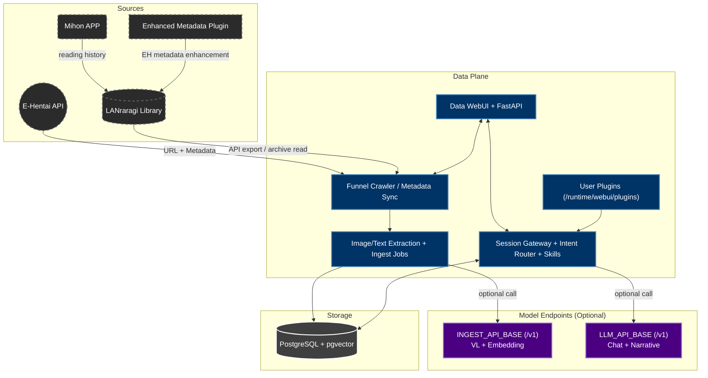

# AutoEhHunter

> 🌐 Language / 语言: [English](README_EN.md) | [中文](README.md)

### Private Multimodal RAG Retrieval System for E-Hentai and LANraragi

  

  
   
  <em>AutoEhHunter</em>

## Motivation

**"I remember the cover and plot vibe, but still can't find that work because I forgot the exact tag/title."**

AutoEhHunter is built to move from rigid keyword search to semantic + visual retrieval.

## Overview

AutoEhHunter now uses the **Data container** as the primary entry point for:

- EH/LRR sync and metadata cleaning
- SigLIP vector ingestion
- Text / image / hybrid retrieval
- Chat routing, skills, and plugin extension

## Architecture

## Core Features

### 1. Multimodal Retrieval
* Visual search (image to vectors)
* Text search with fuzzy tag mapping
* Hybrid search with multi-channel weighting

### 2. Data Pipeline
* EH funnel crawling + LRR export
* Optional metadata enhancement and translation
* Scheduled ingestion jobs

### 3. Recommendation / Profile
* XP clustering and preference estimation
* Tunable strictness and Tag/Visual weights

### 4. Chat + Skills
* Auto/manual intents: chat/profile/search/report/recommendation
* Built-in skills + runtime plugin loading

## Requirements

### `data-ui` container (primary)
* WebUI + FastAPI + scheduler + chat gateway
* CPU-only default is supported

### External model endpoints (optional)
* OpenAI-compatible `/v1`
* Single endpoint for VL/Embedding/LLM, or split ingest/chat endpoints

## Getting Started

* [Quick Start](STARTUP_EN.md)
* [中文启动指南](STARTUP.md)
* [Contribution Guide](CONTRIBUTING_EN.md)

## Config & Persistence

- Priority: `app_config(DB) > JSON fallback > .env`
- You can start first and configure from Settings later
- Without LLM config, baseline features still work

## Tech Stack

* PostgreSQL 17 + pgvector
* FastAPI + Vue 3
* SigLIP (CPU-only default)
* OpenAI-compatible `/v1` endpoints

## Disclaimer

For personal retrieval research and archiving only. Follow site ToS and local regulations.
